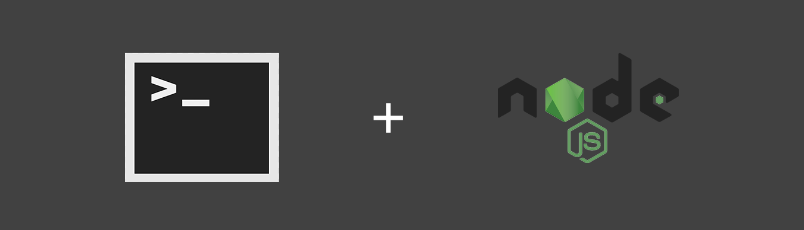
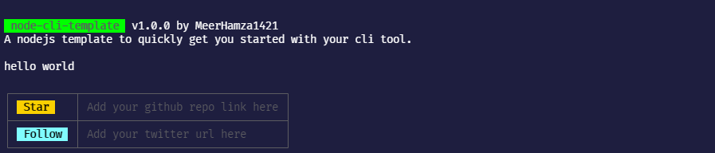

<h3>A nodejs template to quickly get you started with your cli tool.</h3> 

# Usage 🚀

### Template Setup 💥

- Either fork the repo or click on the Use this template button to create a new repository with this template.
- Now clone the repo, open it in your preferred code editor, and install all the dependencies using `npm install`.

### CLI Setup ⚙
- Open `package.json` file and enter desired data in empty attributes e.g _name_.
- Replace `command-name` with desired command in the _bin_ attribute.
- Add your username in the license file in place of `your-name`.
- Now to configure and test cli locally run `npm link` in the project directory.
- Now simply start coding in `cli.js`

# Preview 🔎

# PROPS 🙌🏻 
- Header Image by [Afzal Ashraf](https://github.com/afzalashraf666)

# AUTHOR 👨🏻‍💻

🙋🏻‍♂️ Yo! It's Meer, a junior year CS undergrad. Let's get connected

&nbsp;
&nbsp;
&nbsp;

# External Link⚡

To get an idea of different files used in the project. You can read this article by [Saad Irfan](https://github.com/msaaddev/).

[Read Article](https://dev.to/msaaddev/files-every-open-source-project-must-have-2mmm)
